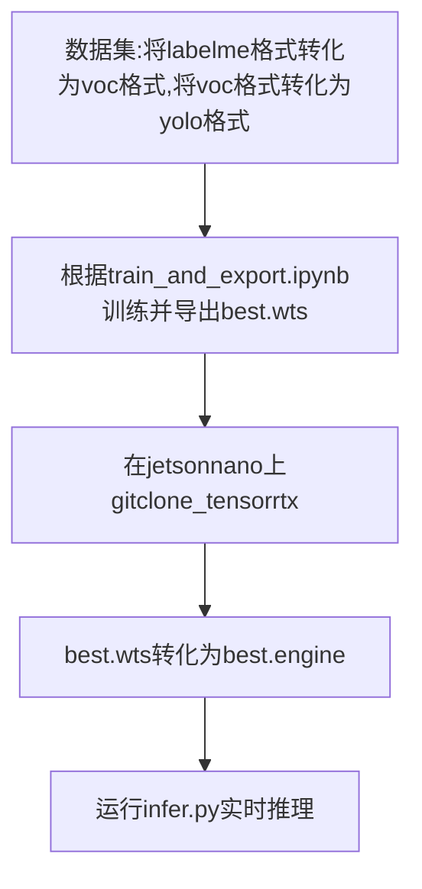

#  一、 pytorch训练+nano部署(tensorrt)

我的Nano环境:

| item | 版本 |
| ---- | ---- |
|  cuda    |    10.2  |
|   jetpack   | 4.4     |
|   tensorrt   |   7.1.3   |
|torch&torchvision|不需要|




## 1  数据集转化

​	git clone https://github.com/Promethe-us/DeployOnJetsonNano

里面有数据集转化的py文件

- labelme打完标签的数据后是这样的:

  

- 运行 labelme2voc.py转成voc数据集

- 运行 voc2yolo.py文件转成yolo数据集

  

## 2  训练并导出模型

按照中的**DeployOnJetsonNano/yolov5/tran_and_export.ipynb**操作即可，得到 best.wts 文件下载到nano上

## 3  .wts转为.engine

- 在jetsonnano上 

```python
!git clone https://github.com/wang-xinyu/tensorrtx.git
```

​    将best.wts放置在 tensorrtx/yolov5/下

- 修改tensortx/yolov5/yololayer.h 的 CLASS_NUM、INPUT_H、INPUT_W

  
  
- 在tensortx/yolov5/下打开Terminal

  ```
  mkdir build
  cd build
  cmake ..
  make
  ```
  
  转换为 best.engine
  
  ```
  #在build目录下
   sudo ./yolov5 -s ../best.wts ../best.engine s
  ```
  
  在yolov5目录下得到 best.engine

## 4  修改一些小bug

- Illegal instruction (core dumped) :  https://blog.csdn.net/qiaoyurensheng/article/details/121711395?spm=1001.2101.3001.6661.1&utm_medium=distribute.pc_relevant_t0.none-task-blog-2%7Edefault%7ECTRLIST%7ERate-1.pc_relevant_antiscanv2&depth_1-utm_source=distribute.pc_relevant_t0.none-task-blog-2%7Edefault%7ECTRLIST%7ERate-1.pc_relevant_antiscanv2&utm_relevant_index=1
- no module named 'Pycuda':  https://blog.csdn.net/wtlll/article/details/114264207

## 5  运行infer.py

之前git clone了https://github.com/Promethe-us/DeployOnJetsonNano

将DeployOnJetsonNano/yolov5/infer.py 放到 nano的 tensorrtx/yolov5/下面

然后终端运行(USB摄像头，CSI摄像头改一下下infer.py即可)

```
python3 infer.py
```

我选择的是 yolov5 v6.0 inputsize=(320,320)

没有tensorrt加速，帧率为20左右

经过加速(运行infer.py)结果如下:


# 二、 paddle训练+nano部署(tensorrt)

环境信息:


| item | 版本 |
| ---- | ---- |
|  cuda    |    10.2  |
|   jetpack   | 4.4     |
|   tensorrt   |   7.1.3   |
|paddle|2.2.2|


详细流程我发在AIStudio上了:https://aistudio.baidu.com/aistudio/projectdetail/3795449?contributionType=1

使用ppyolo模型(tensorrt加速) 推理效果如下


